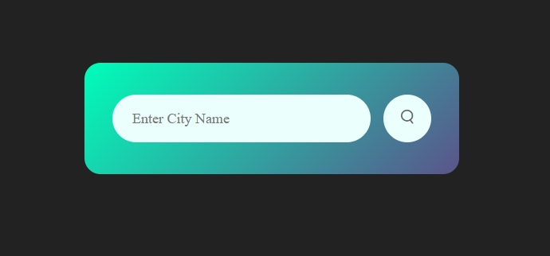

# 🌦 WeatherApp

Eine einfache Wetter-App, die Wetterdaten von einer API abruft und visuell darstellt.  
Dieses Projekt wurde im Rahmen eines YouTube-Tutorials umgesetzt, um meine Fähigkeiten in JavaScript, APIs und Webentwicklung zu verbessern.

## 🎥 Basierend auf folgendem Tutorial

Dieses Projekt basiert auf dem YouTube-Tutorial von **GreatStacks**:  
🔗 [Hier ist der Link zum Original-Tutorial](https://www.youtube.com/watch?v=MIYQR-Ybrn4&list=PLjwm_8O3suyOgDS_Z8AWbbq3zpCmR-WE9&index=1&pp=iAQB)

## 🚀 Live-Demo

🔗 **[Hier klicken, um die App zu testen](https://DEINE-LIVE-URL.com)** (Falls du sie gehostet hast)

## 🛠️ Technologien

- HTML, CSS, JavaScript
- OpenWeatherMap API
- WebStorm als IDE

## 📷 Screenshots




## 📌 Features

✔ Echtzeit-Wetterdaten abrufen  
✔ Suchfunktion für Städte  
✔ Icons für verschiedene Wetterzustände  
✔ Benutzerfreundliche Oberfläche

## 🏗️ Installation

Falls du die App lokal starten möchtest:

1. **Projekt klonen**
   ```sh
   git clone https://github.com/Berch10/WeatherApp.git
   cd WeatherApp
